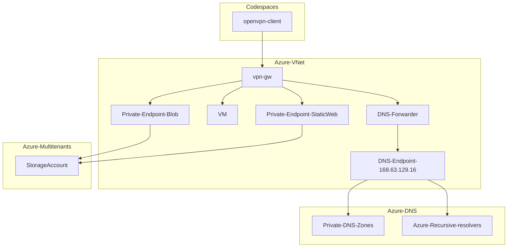

# Connecting GitHub Codespaces and Azure VNet with OpenVPN

## Overview

* Sample devcontainer configuration and Terraform HCL for connecting GitHub Codespaces and Azure VNet with OpenVPN.
* DNS forwarding with forwarder container(CoreDNS) for Azure VM / Private Endpoint name resolution
  * No need to remember the IP addresses to access VMs and Private Endpoints from Codespaces

A pattern that achieves the same purpose with Tailscale is the following.

> [Connecting GitHub Codespaces and Azure VNet with Tailscale](https://github.com/ToruMakabe/tailscale-codespaces-azure-sample)

## Notes

### Authorization

To allow OpenVPN client on Codespaces to connect Azure VPN Gateway, you have to pass OpenVPN config as OPENVPN_CONFIG environment variable. Storing it in Codespaces Secret is an easy way.

> [Using the OpenVPN client from GitHub Codespaces](https://github.com/codespaces-contrib/codespaces-openvpn)

All certificate, key and config are stored in [Key Vault](./terraform/main.tf).

#### systemd-resovled or not

This Terraform codes generates two types of OpenVPN config, one with systemd-resolved based environment and one is without. For the Codespaces environment created in this sample, use a config that is not for systemd-resolved.

### Azure VM / Private Endpoint DNS configuration

Add DNS suffix to [config file](./terraform/config/openvpn/dhcp_options) for forwarding. For examaple, you have to add the following suffixes to get this sample work

* internal.cloudapp.net
* web.core.windows.net
* blob.core.windows.net

See below for other zones

> [Azure Private Endpoint DNS configuration](https://docs.microsoft.com/en-us/azure/private-link/private-endpoint-dns)
